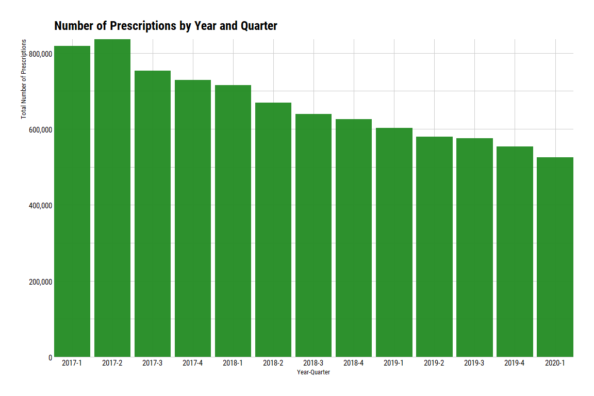
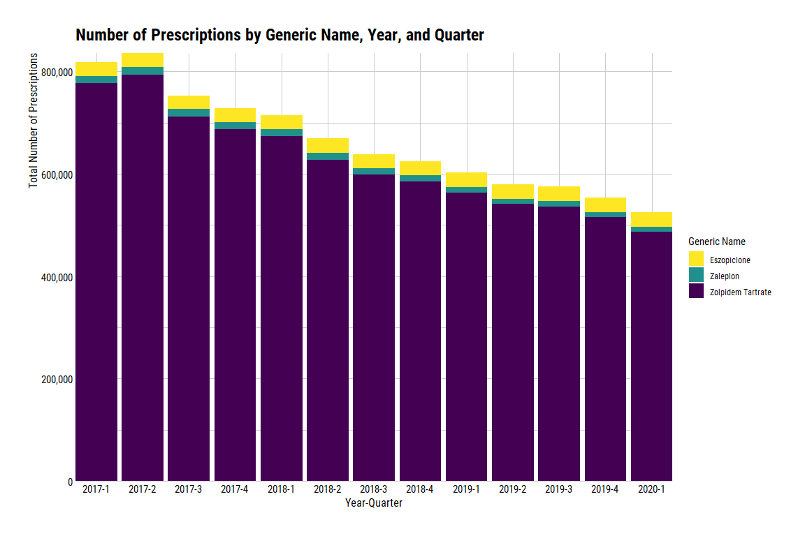
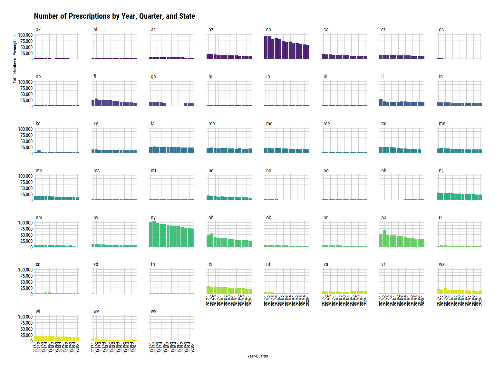
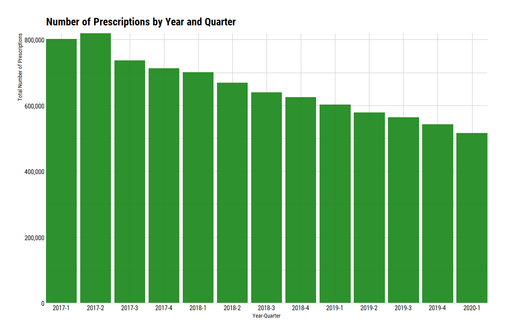
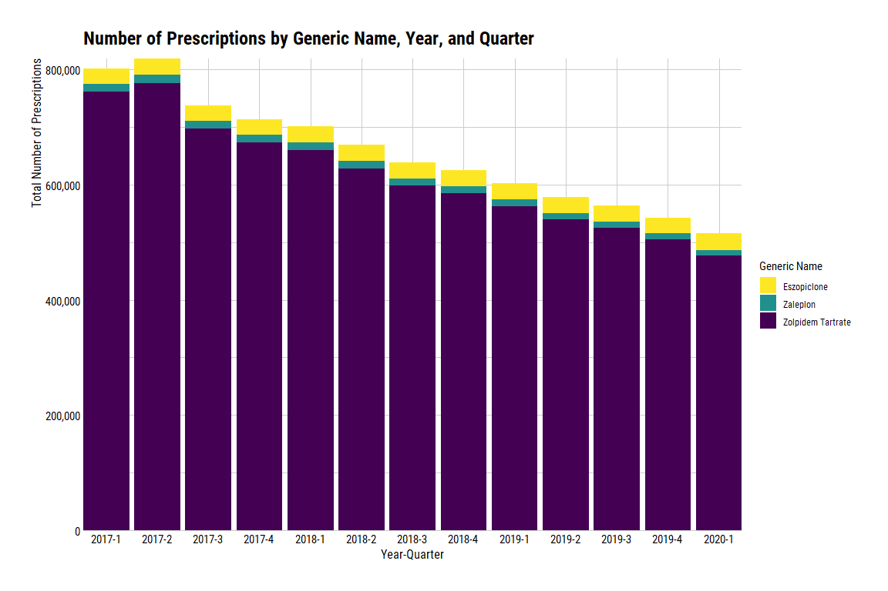
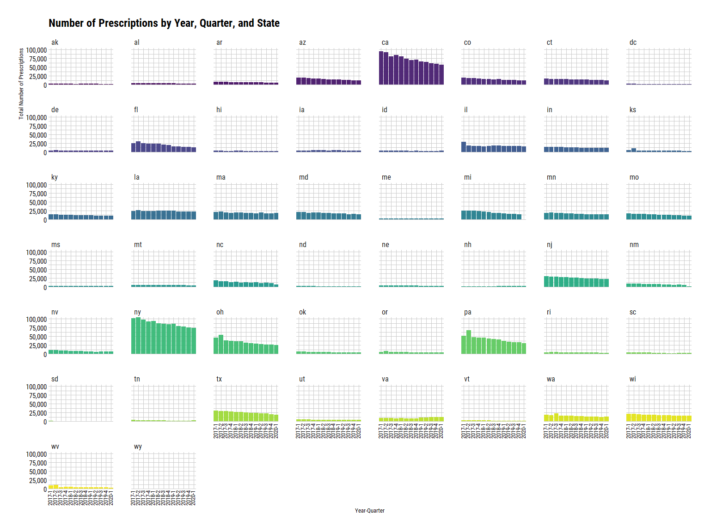

Z Drugs Q1 2017 - Q1 2020
================
Michael Maguire, MS
3/15/2021

## Request Prompt:

Can you please cut the SDUD data to get only prescriptions for
eszopiclone (Lunesta), zaleplon (Sonata), and zolpidem (Ambien, Ambien
CR, Edluar, Intermezzo, Zolpimist) from Q12017 to Q12020 (each state)?
Please include those that have suppressed records too.

### Load libraries

``` r
library(dplyr)
library(ggplot2)
library(hrbrthemes)
library(purrr)
library(readr)
library(stringr)
library(tidylog)
library(viridis)
```

### Step 1: Pull in SDUD dataset.

Note: location of data set is a personal directory, so I have masked it.

``` r
sdud_2017_2020 <-
  read_rds(
    file = loc
  ) %>%
  filter(year %in% c(2017:2019) | year == 2020 & quarter == 1)
```

    ## filter: removed 49,143,143 rows (77%), 14,574,088 rows remaining

Examine years and quarters to ensure the correct period is pulled.

``` r
sdud_2017_2020 %>%
  distinct(year, quarter) %>%
  arrange(year, desc(quarter))
```

    ## distinct: removed 14,574,075 rows (>99%), 13 rows remaining

    ## # A tibble: 13 x 2
    ##     year quarter
    ##    <int>   <int>
    ##  1  2017       4
    ##  2  2017       3
    ##  3  2017       2
    ##  4  2017       1
    ##  5  2018       4
    ##  6  2018       3
    ##  7  2018       2
    ##  8  2018       1
    ##  9  2019       4
    ## 10  2019       3
    ## 11  2019       2
    ## 12  2019       1
    ## 13  2020       1

### Step 2: Flag records containing generic name.

``` r
sdud_2017_2020_gennmes <- 
  sdud_2017_2020 %>%
  mutate(
    eszcopiclone_flag = case_when(
      str_detect(string = gennme_c, pattern = regex("eszopiclone", ignore_case = TRUE)) ~ "1",
      TRUE ~ "0"
    ),
    zaleplon_flag = case_when(
      str_detect(string = gennme_c, pattern = regex("zaleplon", ignore_case = TRUE)) ~ "1",
      TRUE ~ "0"
    ),
    zolpidem_flag = case_when(
      str_detect(string = gennme_c, pattern = regex("zolpidem", ignore_case = TRUE)) ~ "1",
      TRUE ~ "0"
    )
  )
```

    ## mutate: new variable 'eszcopiclone_flag' (character) with 2 unique values and 0% NA

    ##         new variable 'zaleplon_flag' (character) with 2 unique values and 0% NA

    ##         new variable 'zolpidem_flag' (character) with 2 unique values and 0% NA

Checking flags.

``` r
sdud_2017_2020_gennmes %>%
  select(eszcopiclone_flag, zaleplon_flag, zolpidem_flag) %>%
  map(., janitor::tabyl)
```

    ## select: dropped 32 variables (utilization_type, state, year, quarter, number_of_prescriptions, …)

    ## $eszcopiclone_flag
    ##  .x[[i]]        n     percent
    ##        0 14556582 0.998798827
    ##        1    17506 0.001201173
    ## 
    ## $zaleplon_flag
    ##  .x[[i]]        n      percent
    ##        0 14568147 0.9995923587
    ##        1     5941 0.0004076413
    ## 
    ## $zolpidem_flag
    ##  .x[[i]]        n     percent
    ##        0 14541539 0.997766653
    ##        1    32549 0.002233347

### Step 3: Aggregate by state, year, quarter and sum.

``` r
# Filter off on flags created above.
sdud_2017_2020_z_flags <-
  sdud_2017_2020_gennmes %>%
  filter(
    eszcopiclone_flag == "1" | zaleplon_flag == "1" | zolpidem_flag == "1"
  )
```

    ## filter: removed 14,518,092 rows (>99%), 55,996 rows remaining

``` r
# Create data set containing generic name, brand name, and ndc number.
ndc_gen_brand_names <- 
  sdud_2017_2020_z_flags %>%
  distinct(gennme_c, prodnme, ndc)
```

    ## distinct: removed 55,844 rows (>99%), 152 rows remaining

``` r
# Examine data set.
ndc_gen_brand_names
```

    ## # A tibble: 152 x 3
    ##    ndc         gennme_c          prodnme          
    ##    <chr>       <chr>             <chr>            
    ##  1 65862096730 Eszopiclone       ESZOPICLONE      
    ##  2 57237024001 Zaleplon          ZALEPLON         
    ##  3 65862015901 Zolpidem Tartrate ZOLPIDEM TARTRATE
    ##  4 00378531005 Zolpidem Tartrate ZOLPIDEM TARTRATE
    ##  5 10370011610 Zolpidem Tartrate ZOLPIDEM TARTRATE
    ##  6 00093007401 Zolpidem Tartrate ZOLPIDEM TARTRATE
    ##  7 68462038401 Eszopiclone       ESZOPICLONE      
    ##  8 00093553756 Eszopiclone       ESZOPICLONE      
    ##  9 47335030888 Zolpidem Tartrate ZOLPIDEM TARTRATE
    ## 10 00054008525 Zaleplon          ZALEPLON         
    ## # ... with 142 more rows

``` r
# Create aggregate by state, year, quarter, and suppression.
sdud_2017_2020_zdrugs <- 
  sdud_2017_2020_z_flags %>%
    group_by(state, year, quarter, suppression_used) %>%
    summarize(total_prescriptions = sum(number_of_prescriptions))
```

    ## group_by: 4 grouping variables (state, year, quarter, suppression_used)

    ## summarize: now 1,267 rows and 5 columns, 3 group variables remaining (state, year, quarter)

``` r
# Create aggregate by state, year, quarter, generic name, and suppression. 
sdud_2017_2020_zdrugs_rx <-
  sdud_2017_2020_z_flags %>%
    group_by(state, year, quarter, gennme_c, suppression_used) %>%
    summarize(total_prescriptions = sum(number_of_prescriptions))
```

    ## group_by: 5 grouping variables (state, year, quarter, gennme_c, suppression_used)

    ## summarize: now 3,669 rows and 6 columns, 4 group variables remaining (state, year, quarter, gennme_c)

### Step 4: Plot number of prescriptions over time.

``` r
# Plot showing number of prescriptions by year and quarter.
ggplot(data = sdud_2017_2020_zdrugs) +
  geom_col(aes(x = paste0(year, "-", quarter), y = total_prescriptions), fill = "forestgreen", alpha = 0.95) +
    scale_y_continuous(labels = scales::comma) + 
    theme_ipsum_rc(axis_title_just = "ct") +
    ggtitle("Number of Prescriptions by Year and Quarter") +
    xlab("Year-Quarter") +
    ylab("Total Number of Prescriptions") +
    theme(
      axis.text.x = element_text(color = "black"),
      axis.text.y = element_text(color = "black"),
      axis.title.x = element_text(color = "black", size = 10),
      axis.title.y = element_text(color = "black", size = 10),
    ) +
    coord_cartesian(expand = FALSE)
```

<!-- -->

``` r
# Plot showing number of prescriptions by year, quarter, and generic name.
ggplot(data = sdud_2017_2020_zdrugs_rx) +
  geom_col(aes(x = paste0(year, "-", quarter), y = total_prescriptions, fill = gennme_c)) +
    scale_fill_viridis_d(direction = -1) +
    scale_y_continuous(labels = scales::comma) +
    theme_ipsum_rc(axis_title_just = "ct") +
    ggtitle("Number of Prescriptions by Generic Name, Year, and Quarter") +
    xlab("Year-Quarter") +
    ylab("Total Number of Prescriptions") +
    labs(fill = "Generic Name") +
    theme(
      axis.text.x = element_text(color = "black"),
      axis.text.y = element_text(color = "black"),
      axis.title.x = element_text(color = "black", size = 12),
      axis.title.y = element_text(color = "black", size = 12)
    ) +
    coord_cartesian(expand = FALSE)
```

<!-- -->

``` r
# Plot showing number of prescriptions by year, quarter, and state.
ggplot(data = sdud_2017_2020_zdrugs) +
  geom_col(aes(x = paste0(year, "-", quarter), y = total_prescriptions, fill = state), alpha = 0.95) +
    scale_fill_viridis_d() +
    scale_y_continuous(labels = scales::comma) + 
    theme_ipsum_rc(axis_title_just = "ct") +
    ggtitle("Number of Prescriptions by Year, Quarter, and State") +
    xlab("Year-Quarter") +
    ylab("Total Number of Prescriptions") +
    theme(
      axis.text.x = element_text(color = "black", angle = 90, size = 10, hjust = 0.25, vjust = 0.25),
      axis.text.y = element_text(color = "black"),
      axis.title.x = element_text(color = "black", size = 10),
      axis.title.y = element_text(color = "black", size = 10),
      legend.position = "none"
    ) +
    facet_wrap(~state) +
    coord_cartesian(expand = FALSE)
```

<!-- -->
\#\# JHC noticed GA has missing observations in 2018.

Repeat process without GA records.

### Step 5: Aggregate by state, year, quarter and sum, without GA.

``` r
# Filter off on flags created above.
sdud_2017_2020_z_flags_rm_ga <-
  sdud_2017_2020_gennmes %>%
  filter(
    (eszcopiclone_flag == "1" | zaleplon_flag == "1" | zolpidem_flag == "1") & state != "ga"
  )
```

    ## filter: removed 14,518,968 rows (>99%), 55,120 rows remaining

``` r
# Create data set containing generic name, brand name, and ndc number.
ndc_gen_brand_names_rm_ga <- 
  sdud_2017_2020_z_flags_rm_ga %>%
  distinct(gennme_c, prodnme, ndc)
```

    ## distinct: removed 54,968 rows (>99%), 152 rows remaining

``` r
# Examine data set.
ndc_gen_brand_names_rm_ga
```

    ## # A tibble: 152 x 3
    ##    ndc         gennme_c          prodnme          
    ##    <chr>       <chr>             <chr>            
    ##  1 65862096730 Eszopiclone       ESZOPICLONE      
    ##  2 57237024001 Zaleplon          ZALEPLON         
    ##  3 65862015901 Zolpidem Tartrate ZOLPIDEM TARTRATE
    ##  4 00378531005 Zolpidem Tartrate ZOLPIDEM TARTRATE
    ##  5 10370011610 Zolpidem Tartrate ZOLPIDEM TARTRATE
    ##  6 00093007401 Zolpidem Tartrate ZOLPIDEM TARTRATE
    ##  7 68462038401 Eszopiclone       ESZOPICLONE      
    ##  8 00093553756 Eszopiclone       ESZOPICLONE      
    ##  9 47335030888 Zolpidem Tartrate ZOLPIDEM TARTRATE
    ## 10 00054008525 Zaleplon          ZALEPLON         
    ## # ... with 142 more rows

``` r
# Create aggregate by state, year, quarter, and suppression.
sdud_2017_2020_zdrugs_rm_ga <- 
  sdud_2017_2020_z_flags_rm_ga %>%
    group_by(state, year, quarter, suppression_used) %>%
    summarize(total_prescriptions = sum(number_of_prescriptions))
```

    ## group_by: 4 grouping variables (state, year, quarter, suppression_used)

    ## summarize: now 1,249 rows and 5 columns, 3 group variables remaining (state, year, quarter)

``` r
# Create aggregate by state, year, quarter, generic name, and suppression. 
sdud_2017_2020_zdrugs_rx_rm_ga <-
  sdud_2017_2020_z_flags_rm_ga %>%
    group_by(state, year, quarter, gennme_c, suppression_used) %>%
    summarize(total_prescriptions = sum(number_of_prescriptions))
```

    ## group_by: 5 grouping variables (state, year, quarter, gennme_c, suppression_used)

    ## summarize: now 3,622 rows and 6 columns, 4 group variables remaining (state, year, quarter, gennme_c)

### Step 6: Plot number of prescriptions over time, without GA.

``` r
# Plot showing number of prescriptions by year and quarter.
ggplot(data = sdud_2017_2020_zdrugs_rm_ga) +
  geom_col(aes(x = paste0(year, "-", quarter), y = total_prescriptions), fill = "forestgreen", alpha = 0.95) +
    scale_y_continuous(labels = scales::comma) + 
    theme_ipsum_rc(axis_title_just = "ct") +
    ggtitle("Number of Prescriptions by Year and Quarter") +
    xlab("Year-Quarter") +
    ylab("Total Number of Prescriptions") +
    theme(
      axis.text.x = element_text(color = "black"),
      axis.text.y = element_text(color = "black"),
      axis.title.x = element_text(color = "black", size = 10),
      axis.title.y = element_text(color = "black", size = 10),
    ) +
    coord_cartesian(expand = FALSE)
```

<!-- -->

``` r
# Plot showing number of prescriptions by year, quarter, and generic name.
ggplot(data = sdud_2017_2020_zdrugs_rx_rm_ga) +
  geom_col(aes(x = paste0(year, "-", quarter), y = total_prescriptions, fill = gennme_c)) +
    scale_fill_viridis_d(direction = -1) +
    scale_y_continuous(labels = scales::comma) +
    theme_ipsum_rc(axis_title_just = "ct") +
    ggtitle("Number of Prescriptions by Generic Name, Year, and Quarter") +
    xlab("Year-Quarter") +
    ylab("Total Number of Prescriptions") +
    labs(fill = "Generic Name") +
    theme(
      axis.text.x = element_text(color = "black"),
      axis.text.y = element_text(color = "black"),
      axis.title.x = element_text(color = "black", size = 12),
      axis.title.y = element_text(color = "black", size = 12)
    ) +
    coord_cartesian(expand = FALSE)
```

<!-- -->

``` r
# Plot showing number of prescriptions by year, quarter, and state.
ggplot(data = sdud_2017_2020_zdrugs_rm_ga) +
  geom_col(aes(x = paste0(year, "-", quarter), y = total_prescriptions, fill = state), alpha = 0.95) +
    scale_fill_viridis_d() +
    scale_y_continuous(labels = scales::comma) + 
    theme_ipsum_rc(axis_title_just = "ct") +
    ggtitle("Number of Prescriptions by Year, Quarter, and State") +
    xlab("Year-Quarter") +
    ylab("Total Number of Prescriptions") +
    theme(
      axis.text.x = element_text(color = "black", angle = 90, size = 10, hjust = 0.25, vjust = 0.25),
      axis.text.y = element_text(color = "black"),
      axis.title.x = element_text(color = "black", size = 10),
      axis.title.y = element_text(color = "black", size = 10),
      legend.position = "none"
    ) +
    facet_wrap(~state) +
    coord_cartesian(expand = FALSE)
```

<!-- -->
