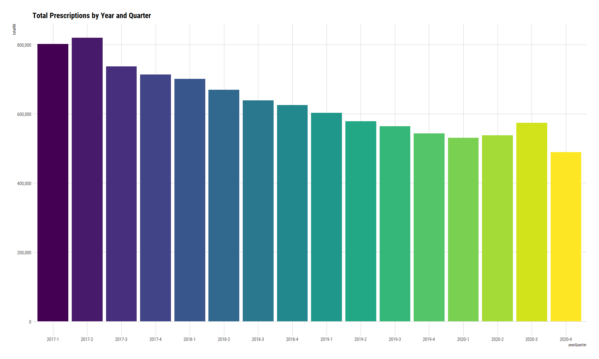
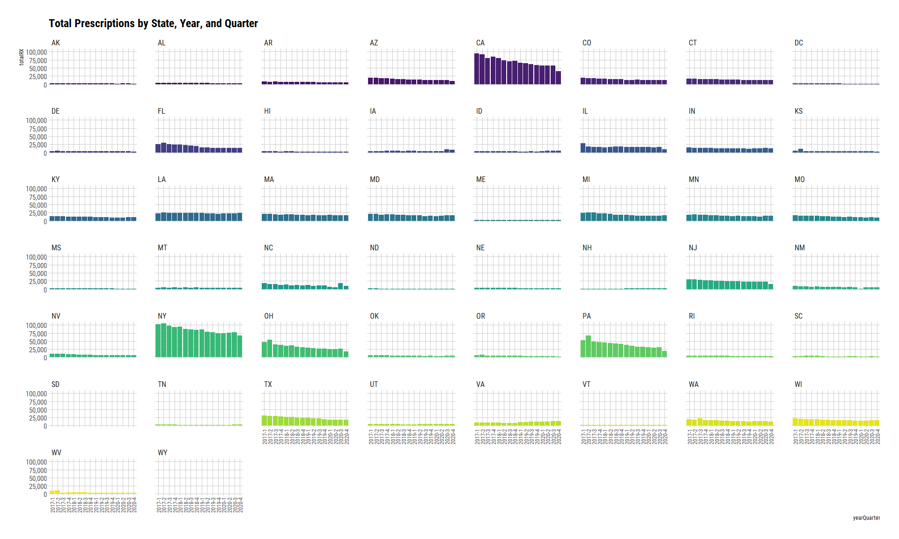
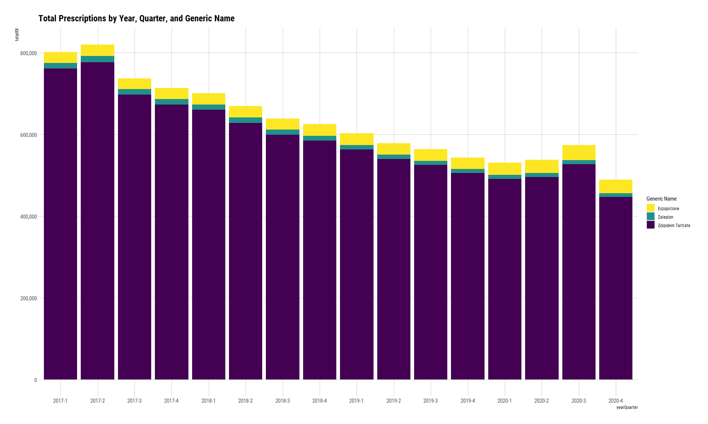
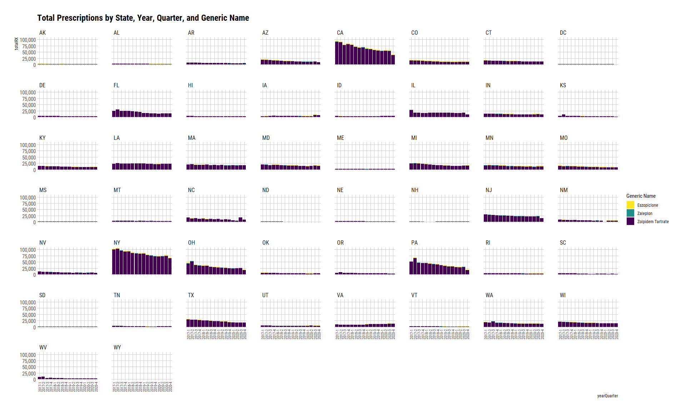
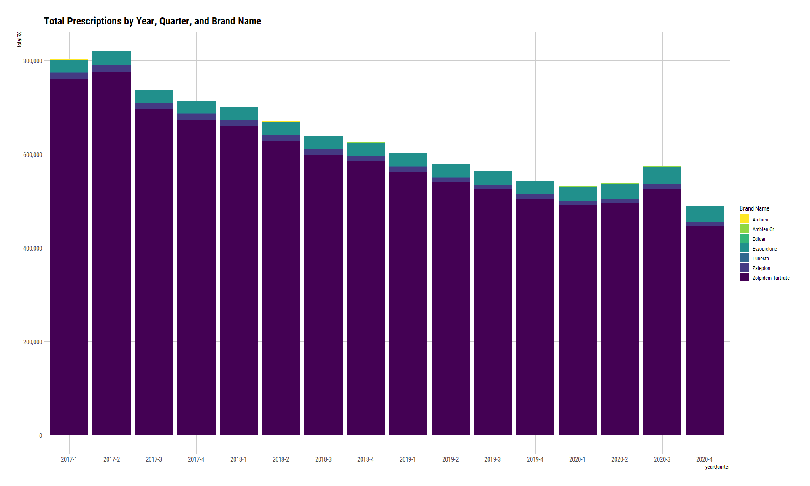
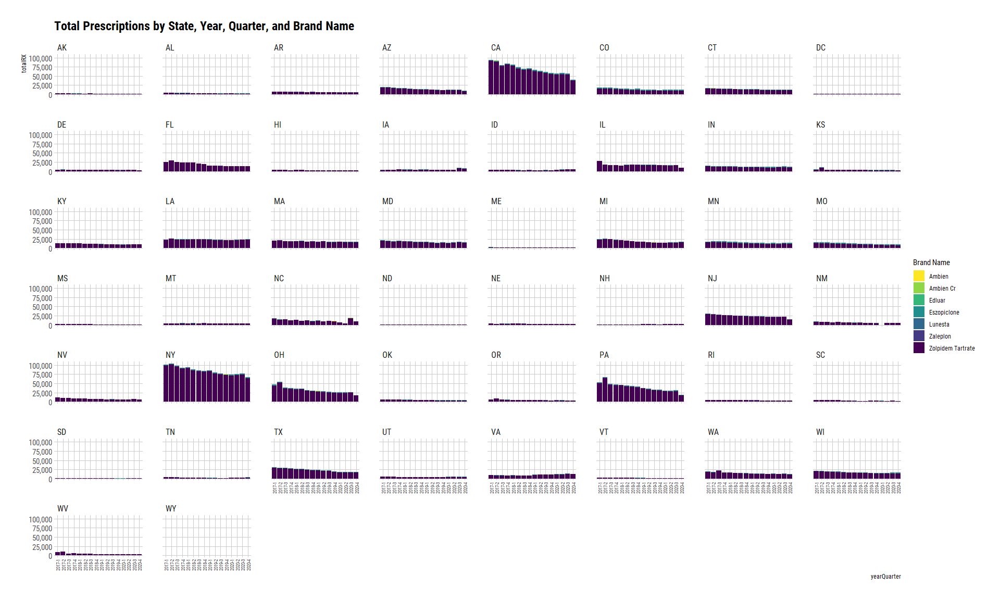

SDUD Z-Drugs 2017 - 2010
================
Michael Quinn Maguire, MS
6/9/2021

``` r
library(data.table)
library(tidyverse)
library(hrbrthemes)
```

### Read in the dataset.

### Coerce NDC to character. Otherwise it is read as integer.

``` r
base <-
  fread(
    file_location,
    colClasses = c("proper_ndc" = "character")
  )

base
```

    ##            proper_ndc utilization.type year quarter state suppression numberrx
    ##        1: 00002010102             FFSU 2020       2    TN           T        0
    ##        2: 00002010102             FFSU 2020       3    TN           T        0
    ##        3: 00002010102             MCOU 2020       4    TN           F       41
    ##        4: 00002010102             MCOU 2020       3    TN           F       59
    ##        5: 00002010102             MCOU 2020       1    TN           F       24
    ##       ---                                                                     
    ## 65622560: 99207086508             FFSU 2003       4    NE           T        0
    ## 65622561: 99207086508             FFSU 2003       4    CA           T        0
    ## 65622562: 99207086508             FFSU 2003       3    CA           T        0
    ## 65622563: 99207086508             FFSU 2003       4    IL           T        0
    ## 65622564: 99207086508             FFSU 2003       4    WA           T        0
    ##           seqidall seqidndc deaclas generid maintin prodcat siglsrc genind
    ##        1:  1240839    42188       7  999999       3       8       N      6
    ##        2:  2876968    42188       7  999999       3       8       N      6
    ##        3:  3408684    42188       7  999999       3       8       N      6
    ##        4:  3740945    42188       7  999999       3       8       N      6
    ##        5:  3805218    42188       7  999999       3       8       N      6
    ##       ---                                                                 
    ## 65622560: 57391510    91939       7  117166       4       7       N      6
    ## 65622561: 58035571    91939       7  117166       4       7       N      6
    ## 65622562: 58050004    91939       7  117166       4       7       N      6
    ## 65622563: 58450139    91939       7  117166       4       7       N      6
    ## 65622564: 58528983    91939       7  117166       4       7       N      6
    ##           desidrg mastfrm pkqtycd thercls thergrp pksize    therdtl
    ##        1:       N     ECT      EA     101      13    100 4004010030
    ##        2:       N     ECT      EA     101      13    100 4004010030
    ##        3:       N     ECT      EA     101      13    100 4004010030
    ##        4:       N     ECT      EA     101      13    100 4004010030
    ##        5:       N     ECT      EA     101      13    100 4004010030
    ##       ---                                                          
    ## 65622560:       N     SHA      EA     201      26      1 8432010030
    ## 65622561:       N     SHA      EA     201      26      1 8432010030
    ## 65622562:       N     SHA      EA     201      26      1 8432010030
    ## 65622563:       N     SHA      EA     201      26      1 8432010030
    ## 65622564:       N     SHA      EA     201      26      1 8432010030
    ##                          gnindds        metsize         maintds strngth
    ##        1: Over the counter (OTC)       EA 00100 Primarily acute  7.5 GR
    ##        2: Over the counter (OTC)       EA 00100 Primarily acute  7.5 GR
    ##        3: Over the counter (OTC)       EA 00100 Primarily acute  7.5 GR
    ##        4: Over the counter (OTC)       EA 00100 Primarily acute  7.5 GR
    ##        5: Over the counter (OTC)       EA 00100 Primarily acute  7.5 GR
    ##       ---                                                              
    ## 65622560: Over the counter (OTC) 000236.0000 ML  ~Missing/Other      5%
    ## 65622561: Over the counter (OTC) 000236.0000 ML  ~Missing/Other      5%
    ## 65622562: Over the counter (OTC) 000236.0000 ML  ~Missing/Other      5%
    ## 65622563: Over the counter (OTC) 000236.0000 ML  ~Missing/Other      5%
    ## 65622564: Over the counter (OTC) 000236.0000 ML  ~Missing/Other      5%
    ##               prdctds                   thrdtds                mstfmds
    ##        1: OTC/Generic Ammonium Chloride & Comb. Tablet, Enteric Coated
    ##        2: OTC/Generic Ammonium Chloride & Comb. Tablet, Enteric Coated
    ##        3: OTC/Generic Ammonium Chloride & Comb. Tablet, Enteric Coated
    ##        4: OTC/Generic Ammonium Chloride & Comb. Tablet, Enteric Coated
    ##        5: OTC/Generic Ammonium Chloride & Comb. Tablet, Enteric Coated
    ##       ---                                                             
    ## 65622560:   OTC/Trade     Coal Tar & Comb., S/M                Shampoo
    ## 65622561:   OTC/Trade     Coal Tar & Comb., S/M                Shampoo
    ## 65622562:   OTC/Trade     Coal Tar & Comb., S/M                Shampoo
    ## 65622563:   OTC/Trade     Coal Tar & Comb., S/M                Shampoo
    ## 65622564:   OTC/Trade     Coal Tar & Comb., S/M                Shampoo
    ##                                  thrclds                      thrgrds deaclds
    ##        1:         Acidifying Agents, NEC Electrolytic, Caloric, Water     OTC
    ##        2:         Acidifying Agents, NEC Electrolytic, Caloric, Water     OTC
    ##        3:         Acidifying Agents, NEC Electrolytic, Caloric, Water     OTC
    ##        4:         Acidifying Agents, NEC Electrolytic, Caloric, Water     OTC
    ##        5:         Acidifying Agents, NEC Electrolytic, Caloric, Water     OTC
    ##       ---                                                                    
    ## 65622560: Keratoplastic Agents S/MM, NEC       Skin & Mucous Membrane     OTC
    ## 65622561: Keratoplastic Agents S/MM, NEC       Skin & Mucous Membrane     OTC
    ## 65622562: Keratoplastic Agents S/MM, NEC       Skin & Mucous Membrane     OTC
    ## 65622563: Keratoplastic Agents S/MM, NEC       Skin & Mucous Membrane     OTC
    ## 65622564: Keratoplastic Agents S/MM, NEC       Skin & Mucous Membrane     OTC
    ##                             prodnme            gennme
    ##        1: AMMONIUM CHLORIDE TABLETS Ammonium Chloride
    ##        2: AMMONIUM CHLORIDE TABLETS Ammonium Chloride
    ##        3: AMMONIUM CHLORIDE TABLETS Ammonium Chloride
    ##        4: AMMONIUM CHLORIDE TABLETS Ammonium Chloride
    ##        5: AMMONIUM CHLORIDE TABLETS Ammonium Chloride
    ##       ---                                            
    ## 65622560:  PENTRAX MAXIMUM STRENGTH          Coal Tar
    ## 65622561:  PENTRAX MAXIMUM STRENGTH          Coal Tar
    ## 65622562:  PENTRAX MAXIMUM STRENGTH          Coal Tar
    ## 65622563:  PENTRAX MAXIMUM STRENGTH          Coal Tar
    ## 65622564:  PENTRAX MAXIMUM STRENGTH          Coal Tar

### Examine spreadsheet with requested NDC’s

``` r
## Read in SD file.

rxSD <-
  readxl::read_xlsx(
    path = "./data/raw/Z drugs raw data 2020.xlsx",
    col_names = TRUE
  ) %>%
  select(seqidndc)

rxSD %>%
  janitor::get_dupes(seqidndc)
```

    ## No duplicate combinations found of: seqidndc

    ## # A tibble: 0 x 2
    ## # ... with 2 variables: seqidndc <dbl>, dupe_count <int>

``` r
## Store seqIDNDC into a vector.

rxSeq <-
  rxSD %>%
  select(seqidndc) %>%
  as_vector()
```

### Subset to requested years, NDC’s, and states.

``` r
yrSt <-
  base[
    i = year %in% c(2017:2020) & state != "GA" & seqidndc %in% rxSeq,
    j = .(year, proper_ndc, quarter, state, suppression, numberrx, prodnme, gennme)
  ]
```

### Check to ensure all years/quarters from 2015 to 2020 are included.

``` r
yrSt <-
  base[
    i = year %in% c(2017:2020) & state != "GA" & seqidndc %in% rxSeq,
    j = .(year, proper_ndc, quarter, state, suppression, numberrx, prodnme, gennme)
  ]
```

### Aggregate number of prescriptions by year, state, quarter, and suppression.

``` r
drugsAggState <-
  yrSt[
    i  = ,
    j  = .(totalRX = sum(numberrx)),
    by = c("year", "state", "quarter", "suppression")
  ]

setorder(drugsAggState, year, state, quarter, suppression)
```

### Aggregate number of prescriptions by year, generic name, state, quarter, and suppression.

``` r
drugsAggStateGeneric <-
  yrSt[
    i  = ,
    j  = .(totalRX = sum(numberrx)),
    by = c("year", "gennme", "state", "quarter", "suppression")
  ]

setorder(drugsAggStateGeneric, year, state, quarter, gennme, suppression)
```

### Aggregate number of prescriptions by year, brand name, state, quarter, and suppression.

``` r
drugsAggStateProdnme <-
  yrSt[
    i  = ,
    j  = .(totalRX = sum(numberrx)),
    by = c("year", "gennme", "prodnme", "state", "quarter", "suppression")
  ]

setorder(drugsAggStateProdnme, year, state, quarter, gennme, prodnme, suppression)
```

### Drugs included in the dataset

``` r
rxIncluded <-
  unique(yrSt[, c("gennme", "prodnme")], by = c("gennme", "prodnme"))
```

### Plot 1: Total Prescriptions by Year and Quarter

``` r
drugsAggState %>%
  filter(suppression == "F") %>%
  mutate(yearQuarter = paste0(year, "-", quarter)) %>%
  ggplot() +
    geom_col(
      mapping = aes(
        x    = yearQuarter,
        y    = totalRX,
        fill = yearQuarter
      )
    ) +
    scale_fill_viridis_d() +
    theme_ipsum_rc(grid = "XY") +
    theme(
      legend.position = "none"
    ) +
    ggtitle("Total Prescriptions by Year and Quarter") +
    scale_y_continuous(labels = scales::comma)
```

<!-- -->

### Plot 2: Total Prescriptions by State, Year, and Quarter

``` r
drugsAggState %>%
  filter(suppression == "F") %>%
  mutate(yearQuarter = paste0(year, "-", quarter)) %>%
  ggplot() +
    geom_col(
      mapping = aes(
        x    = yearQuarter,
        y    = totalRX,
        fill = state
      )
    ) +
    facet_wrap(~ state) +
    scale_fill_viridis_d() +
    theme_ipsum_rc(grid = "XY") +
    theme(
      legend.position = "none",
      axis.text.x = element_text(angle = 90, size = 9, vjust = 0.5)
    ) +
    ggtitle("Total Prescriptions by State, Year, and Quarter") +
    scale_y_continuous(labels = scales::comma)
```

<!-- -->

### Plot 3: Total Prescriptions by Year, Quarter, and Generic Name

``` r
drugsAggStateGeneric %>%
  filter(suppression == "F") %>%
  mutate(yearQuarter = paste0(year, "-", quarter)) %>%
  ggplot() +
    geom_col(
      mapping = aes(
        x    = yearQuarter,
        y    = totalRX,
        fill = gennme
      )
    ) +
    labs(
      fill = "Generic Name"
    ) +
    scale_fill_viridis_d(direction = -1) +
    theme_ipsum_rc(grid = "XY") +
    ggtitle("Total Prescriptions by Year, Quarter, and Generic Name") +
    scale_y_continuous(labels = scales::comma)
```

<!-- -->

### Plot 4: Total Prescriptions by State, Year, Quarter, and Generic Name

``` r
drugsAggStateGeneric %>%
  filter(suppression == "F") %>%
  mutate(yearQuarter = paste0(year, "-", quarter)) %>%
  ggplot() +
    geom_col(
      mapping = aes(
        x    = yearQuarter,
        y    = totalRX,
        fill = gennme
      )
    ) +
    facet_wrap(~ state) +
    labs(
      fill = "Generic Name"
    ) +
    scale_fill_viridis_d(direction = -1) +
    theme_ipsum_rc(grid = "XY") +
    theme(
      axis.text.x = element_text(angle = 90, size = 8, vjust = 0.5)
    ) +
    ggtitle("Total Prescriptions by State, Year, Quarter, and Generic Name") +
    scale_y_continuous(labels = scales::comma)
```

<!-- -->

### Plot 5: Total Prescriptions by Year, Quarter, and Brand Name

``` r
drugsAggStateProdnme %>%
  filter(suppression == "F") %>%
  mutate(
    yearQuarter = paste0(year, "-", quarter),
    prodnme = stringr::str_to_title(prodnme)
  ) %>%
  ggplot() +
    geom_col(
      mapping = aes(
        x    = yearQuarter,
        y    = totalRX,
        fill = prodnme
      )
    ) +
    labs(
      fill = "Brand Name"
    ) +
    scale_fill_viridis_d(direction = -1) +
    theme_ipsum_rc(grid = "XY") +
    ggtitle("Total Prescriptions by Year, Quarter, and Brand Name") +
    scale_y_continuous(labels = scales::comma)
```

<!-- -->

### Plot 6: Total Prescriptions by State, Year, Quarter, and Brand Name

``` r
drugsAggStateProdnme %>%
  filter(suppression == "F") %>%
  mutate(
    yearQuarter = paste0(year, "-", quarter),
    prodnme = stringr::str_to_title(prodnme)
  ) %>%
  ggplot() +
    geom_col(
      mapping = aes(
        x    = yearQuarter,
        y    = totalRX,
        fill = prodnme
      )
    ) +
    facet_wrap(~ state) +
    labs(
      fill = "Brand Name"
    ) +
    scale_fill_viridis_d(direction = -1) +
    theme_ipsum_rc(grid = "XY") +
    theme(
      axis.text.x = element_text(angle = 90, size = 7, vjust = 0.5)
    ) +
    ggtitle("Total Prescriptions by State, Year, Quarter, and Brand Name") +
    scale_y_continuous(labels = scales::comma)
```

<!-- -->
